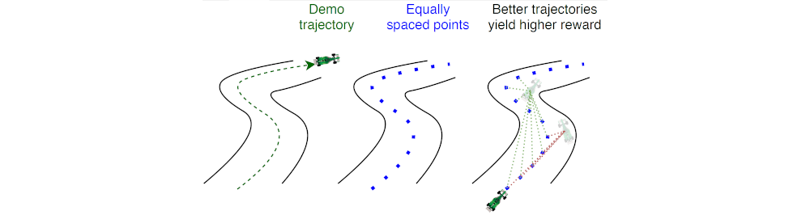
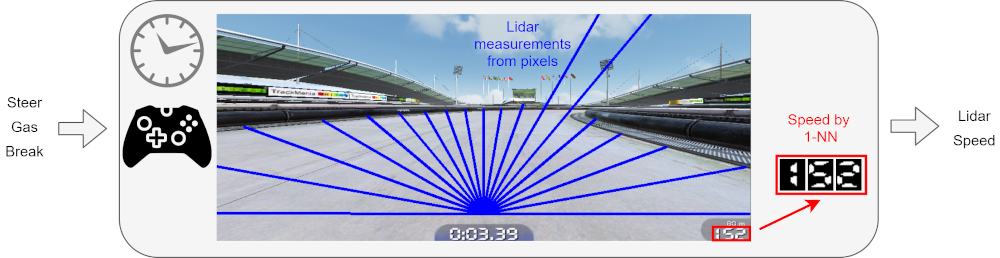

# TMRL
TrackMania Reinforcement Learning (`tmrl`) consists in a Python framework for distributed real-time Reinforcement Learning, demonstated on the TrackMania 2020 and TrackMania Nation Forever video games.


## Quick links
- [Introduction](#introduction)
  - [User features](#user-features)
  - [Developer features](#developer-features)
- [Installation](docs/Install.md)
- [Getting started](docs/get_started.md)
- [TMRL presentation](#tmrl-presentation)
- [Advanced stuff](#advanced-stuff)
    - [Real-time Gym framework](#real-time-gym-framework)
      - [rtgym repo](https://github.com/yannbouteiller/rtgym)
    - [Distant training architecture](#distant-training-architecture)


## Introduction

TMRL uses actual video games, with no insider access, in order to train competitive self-driving Artificial Intelligences (AIs), also called "policies".

These policies are trained with state-of-the-art Deep Reinforcement Learning (RL) algorithms, in real-time.

The framework is demonstrated on TrackMania 2020 and TrackMania Nations Forever.

### User features:
* **State-of-the-art algorithm:**
TMRL trains TrackMania policies with [Soft Actor-Critic](https://arxiv.org/abs/1801.01290) (SAC), an algorithm considered the state-of-the-art in Deep Reinforcement Learning.
SAC stores collected samples in a large dataset, called the replay memory.
In parallel, this dataset is used to train an artificial neural network ("model") that maps observations (images, speed...) to relevant actions (gas, steering angle...).

* **Different types of control:**
TMRL is able to control the video game in several ways, using either a virtual keyboard, or a virtual game controller.

* **Different types of observation:**
The car can use either a LIDAR (Light Detection and Ranging) computed from snapshots, or the raw unprocessed snapshots in order to perceive its environment.

* **Models:**
To process LIDAR measurements, TMRL uses a fully connected neural network.
To process raw camera images (snapshots), it uses a backbone [MobileNetV3](https://arxiv.org/abs/1905.02244).

### Developer features:
* **Distributed training:**
Our training framework is based on a single-server / multiple-clients architecture.
It enables collecting samples locally on one or several computers, and training distantly on a High Performance Computing cluster.
Find out more [here](#distant-training-architecture).

* **Real-time training:**
Our policies are trained in real-time, with no insider access to the game: we do not pause the simulation in order to collect samples nor in order to compute actions.
As such, our approach can easily be extended to other video games, and to real-world robotic applications.
Find out more [here](#real-time-gym-framework).

* **Flexible framework:**
We designed our code so that it is flexible and modular.
It is easily compatible with other applications.
For instance, in other projects, we use the same code base in order to train robots in the real world.
Advanced tutorial coming soon to develop your own applications.

* **External libraries:**
This project gave birth to sub-projects of more general interest that were cut out and packaged in standalone python libraries.
In particular, [rtgym](https://github.com/yannbouteiller/rtgym) enables implementing Gym environments in real-time applications, and [vgamepad](https://github.com/yannbouteiller/vgamepad) enables emulating virtual game controllers.

## Installation

Please find installation instructions [here](docs/Install.md).

## Getting started

Quick start instructions are provided [here](docs/get_started.md).

Following this link, you will find full guidance toward testing pre-trained weights, as well as a tutorial to train, test and fine-tune your own models.


## TMRL presentation

In TMRL, an AI that knows nothing about driving is set at the starting point of a track, and has to learn how to complete the track by exploring its own capacities and environment.

The car feeds observations such as images to an artificial neural network, which must output the best possible controls from these observations.
This implies that the AI must understand its environment in some way.
To achieve this understanding, the car explores the world for a few hours (up to a few days), slowly gaining understanding of how to act efficiently.
This is accomplished through Deep Reinforcement Learning.
More precisely, we use the Soft Actor-Critic (SAC) algorithm.

### Soft Actor-Critic
TODO explain soft actor critic

### Choose a clever reward

As mentioned above, a reward function is needed to evaluate how well the policy performs.

There are multiple reward function that could be used.
For instance, one could directly use the raw speed of the car as a reward.
This makes sense because the car slows down when it crashes and goes fast when it is performing well.
Optimizing the speed as a reward incentives the car to run as fast as it can.
We use exactly this as a reward in TrackMania Nations Forever.

However, such approach is naive.
Indeed, the actual goal of racing is not to move as fast as possible.
Rather, one wants to complete the largest portion of the track in the smallest possible amount of time.
This is not equivalent as one should consider the optimal trajectory, which may imply slowing down on sharp turns to take the apex of the curve.

In Trackmania 2020, we use a more advanced and conceptually more interesting reward function:



For a given track, we record one single demonstration trajectory.
This does not have to be a good demonstration, but only to follow the track.
Once the demonstration trajectory is recorded, it is automatically divided into equally spaced points.

During training, at each time-step, the reward is then the number of such points that the car has passed since the previous time-step.
In a nutshell, whereas the previous reward function was measuring how fast the car was, this new reward function measures how good it is at covering a big portion of the track in a given amount of time.

### Action spaces

In TMRL, the car can be controlled in two different ways:

- TMRL can output simple (binary) arrow presses.
- On Windows, TMRL controls the car with analog control by emulating an XBox360 controller thank to the [vgamepad](https://pypi.org/project/vgamepad/) library.

### Observation spaces

Different observation spaces are available in TMRL:

- A LIDAR measurement computed from real-time screenshots in tracks with black borders
- An history of several such LIDAR measurements (typically the last 4 time-steps)
- An history of raw screenshots (typically 4)

In addition, we provide the norm of the velocity as part of the observation space in all our experiments as we find this greatly helps convergence.

A complete example of RL environment in TrackMania Nations Forever with a single LIDAR measurement is as follows:



In TrackMania Nations Forever, the raw speed is computed from screen captures thanks to the 1-NN algorithm.

In TrackMania 2020, the [OpenPlanet](https://openplanet.nl) API is used to retrieve this raw speed directly.

---

experimentation


## Advanced stuff

### Real-time Gym framework:
This project uses [Real-Time Gym](https://github.com/yannbouteiller/rtgym) (```rtgym```), a simple python framework that enables efficient real-time implementations of Delayed Markov Decision Processes in real-world applications.

```rtgym``` constrains the times at which actions are sent and observations are retrieved as follows:


Time-steps are being elastically constrained to their nominal duration. When this elastic constraint cannot be satisfied, the previous time-step times out and the new time-step starts from the current timestamp.

Custom `rtgym` interfaces for Trackmania used by TMRL are implemented in [custom_gym_interfaces.py](https://github.com/yannbouteiller/tmrl/blob/master/tmrl/custom/custom_gym_interfaces.py).

### Distant training architecture:

To train our model, we developped a client-server framework on the model of [Ray RLlib](https://docs.ray.io/en/latest/rllib.html).
Our client-server architecture is not secured and it is not meant to compete with Ray, but it is much simpler to modify in order to implement ad-hoc pipelines, and works on both Windows and Linux.

We collect training samples from several rollout workers, typically several computers and/or robots.
Each rollout worker stores its collected samples in a local buffer, and periodically sends this replay buffer to the central server.
Periodically, each rollout worker also receives new policy weigths from the central server and updates its policy network.

The central server is located either on the localhost of one of the rollout worker computers, on another computer on the local network, or on another computer on the Internet.
It collects samples from all the connected rollout workers and stores these in a local buffer.
This buffer is periodically sent to the trainer interface.
Periodically, the central server receives updated policy weights from the trainer interface and broadcasts these to all connected rollout workers.

The trainer interface is typically located on a non-rollout worker computer of the local network, or on another computer on the Internet (like a GPU cluster).
Of course, it is also possible to locate it on localhost if needed.
The trainer interface periodically receives the samples gathered by the central server, and appends them to the replay memory of the off-policy actor-critic algorithm.
Periodically, it sends the new policy weights to the central server.

These mechanics can be visualized as follows:


## Authors:
### Maintainers:
- Yann Bouteiller
- Edouard Geze

### Contributors:
- Simon Ramstedt

## License

MIT, Edouard Geze and Yann Bouteiller 2021.