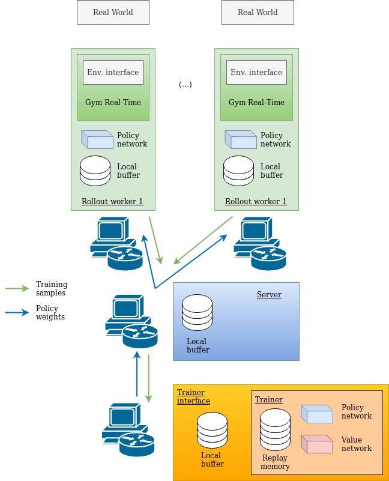

# TMRL
Real-Time Reinforcement Learning python framework with example applications to the Trackmania videogame.

## Authors:
- Yann Bouteiller
- Edouard Geze

### Other contributors:
- Simon Ramstedt

## Real-Time Gym Environment
This project is built with our threaded Real-Time Gym framework for real-world applications.

The threaded Gym framework enables efficient real-time implementations of Delayed Markov Decision Processes in real-world applications.
Its purpose is to elastically constrain action application and observation capture times in a way that is transparent for the user.
It can be reused fairly easily by creating an ad-hoc interface for your application.
Interfaces must inherit the (...)

Once your interface is implemented, your can simply follow the usual pattern:

```python
obs = env.reset()
while True:  # when this loop is broken, the current time-step will timeout
	act = model(obs)  # inference takes a random amount of time
	obs = env.step(act)  # the step function transparently adapts to this duration
```

Our Real-Time Gym framework is clocked by the following code snippet:
```python
now = time.time()
# if either still in the previous time-step of within its allowed elasticity
if now < self.__t_end + self.time_step_timeout:
	# the new time-step starts when the previous time-step is supposed to finish
	# or to have finished
	self.__t_start = self.__t_end
# if after the allowed elasticity
else:
	print(f"INFO: time-step timed out.")
	# the elasticity is broken and reset
	# (this should happen only after 'pausing' the environment)
	self.__t_start = now
# update time at which observation should be retrieved
self.__t_co = self.__t_start + self.start_obs_capture
# update time at which the new time-step should finish
self.__t_end = self.__t_start + self.time_step_duration
```

This timing allows us to implement the core meachnism of Real-Time Gym environments, which can be visualized as follows:


## Distant training architecture

To train our model, we developped a client-server framework on the model of [Ray RLlib](https://docs.ray.io/en/latest/rllib.html).
Our client-server architecture is not secured and it is nowhere close to compete with Ray, but it is much simpler to use and modify, and works on both Windows and Linux.

We collect training samples from several rollout workers, typically several computers and/or robots.
Each rollout worker stores its collected samples in a local buffer, and periodically sends this replay buffer to the central server.
Periodically, each rollout worker also receives new policy weigths from the central server and updates its policy network.

The central server is located either on the localhost of one of the rollout worker computers, on another computer on the local network, or on another computer on the Internet.
It collects samples from all the connected rollout workers and stores them in a local buffer.
This buffer is periodically sent to the trainer interface.
Periodically, the central server receives updates policy weights from the trainer interface and broadcasts them to all connected rollout workers.

The trainer interface is typically located on a non-rollout worker computer of the local network, or on another computer on the Internet (like a GPU farm).
It is possible to locate it on localhost as well if needed.
The trainer interface periodically receives the samples gathered by the central server, and appends them to the replay memory of the off-policy actor-critic algorithm.
Periodically, it sends the new policy weights to the central server.

These mechanics can be visualized as follows:


