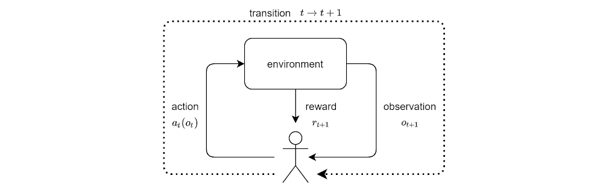

# TMRL

[](https://badge.fury.io/py/tmrl)
[](https://github.com/trackmania-rl/tmrl/blob/master/LICENSE)
[](https://zenodo.org/badge/latestdoi/277973609)

| **`API reference`**                                                                                                                         |
|---------------------------------------------------------------------------------------------------------------------------------------------|
| [](https://tmrl.readthedocs.io/en/latest/?badge=latest) |


`tmrl` is a fully-fledged distributed RL framework for robotics, designed to help you train Deep Reinforcement Learning AIs in real-time applications.

`tmrl` comes with a readily implemented pipeline for the TrackMania 2020 video game.


 **TL;DR:**

- :red_car: **AI and TM enthusiasts:**\
`tmrl` enables you to train AIs in TrackMania with minimal effort. Tutorial for you guys [here](readme/get_started.md), video of a pre-trained AI [here](https://www.youtube.com/watch?v=hQkltOX0TYw), and beginner introduction to the SAC algorithm [here](https://www.youtube.com/watch?v=LN29DDlHp1U).
- :rocket: **ML developers / roboticists:**\
`tmrl` is a python library designed to facilitate the implementation of deep RL applications in real-time settings such as robots and video games. Full tutorial [here](readme/tuto_library.md) and documentation [here](https://tmrl.readthedocs.io/en/latest/).

- :ok_hand: **ML developers who are TM enthusiasts with no interest in learning this huge thing:**\
`tmrl` provides a Gymnasium environment for TrackMania that is easy to use. Fast-track for you guys [here](#trackmania-gymnasium-environment).

- :earth_americas: **Everyone:**\
`tmrl` hosts the [TrackMania Roborace League](readme/competition.md), a vision-based AI competition where participants design real-time self-racing AIs in the TrackMania video game.


## Quick links
- [The TMRL Project](#the-tmrl-project)
  - [Introduction](#introduction)
    - [User features](#user-features-trackmania)
    - [Developer features](#developer-features-real-time-applications-in-python)
    - [TMRL in the media](#tmrl-in-the-media)
  - [Installation](readme/Install.md)
  - [Getting started](readme/get_started.md)
  - [TMRL python library for robot RL](readme/tuto_library.md)
    - [API reference](https://tmrl.readthedocs.io/en/latest/)
  - [Security (important)](#security)
- [TrackMania applications](#autonomous-driving-in-trackmania)
  - [TrackMania Roborace League](readme/competition.md)
  - [TrackMania Gymnasium environment](#trackmania-gymnasium-environment)
    - [LIDAR environment](#lidar-environment)
    - [Full environment](#full-environment)
  - [TrackMania training details](#trackmania-training-details)
    - [RL basics](#reinforcement-learning-basics)
    - [SAC](#soft-actor-critic)
    - [REDQ](#randomized-ensembled-double-q-learning)
    - [A clever reward](#a-clever-reward)
    - [Available action spaces](#available-action-spaces)
    - [Available observation spaces](#available-observation-spaces)
    - [Results](#results)
- [Framework details](#framework-details)
    - [Real-time Gym framework](#real-time-gym-framework)
      - [rtgym repo](https://github.com/yannbouteiller/rtgym)
  - [Remote training architecture](#remote-training-architecture)
- [Contribute](#authors)
- [Sponsors](#sponsors)


# The TMRL project

## Introduction

`tmrl` is a python framework designed to help you train Artificial Intelligences (AIs) through deep Reinforcement Learning (RL), for your own robots or real-time video games.

_Note: In the context of RL, an AI is called a policy._

### User features (TrackMania):
* **Training algorithms:**
`tmrl` lets you easily train policies in TrackMania with state-of-the-art Deep Reinforcement Learning algorithms such as [Soft Actor-Critic](https://www.youtube.com/watch?v=LN29DDlHp1U) (SAC) and [Randomized Ensembled Double Q-Learning](https://arxiv.org/abs/2101.05982) (REDQ).
These algorithms store collected samples in a large dataset, called a replay memory.
In parallel, this dataset is used to train an artificial neural network (policy) that maps observations (images, speed...) to relevant actions (gas, break, steering angle...).

* **Analog control:**
`tmrl` controls the game using a virtual gamepad, which enables analog input.

* **Different types of observation:**
The AI can either use raw unprocessed snapshots, or a LIDAR (Light Detection and Ranging) computed from the snapshots in order to perceive its environment.

* **Models:**
To process LIDAR measurements, `tmrl` uses a Multi-Layer Perceptron (MLP).
To process raw camera images (snapshots), it uses a Convolutional Neural Network (CNN).
These models learn the physics from histories or observations equally spaced in time.

### Developer features (real-time applications in Python):
* **Python library:**
`tmrl` is a complete framework designed to help you successfully implement deep RL in your [real-time applications](#real-time-gym-framework) (e.g., robots...).
A complete tutorial toward doing this is provided [here](readme/tuto_library.md).

* **TrackMania Gymnasium environment:**
`tmrl` comes with a real-time Gymnasium environment for the TrackMania2020 video game, based on [rtgym](https://pypi.org/project/rtgym/). Once `tmrl` is installed, it is easy to use this environment in your own training framework. More information [here](#trackmania-gymnasium-environment).

* **Distributed training:**
`tmrl` is based on a single-server / multiple-clients architecture.
It enables collecting samples locally on one or several computers and training remotely on a High Performance Computing cluster.
Find out more [here](#remote-training-architecture).

* **External libraries:**
This project gave birth to a few sub-projects of more general interest that were cut out and packaged as standalone python libraries.
In particular, [rtgym](https://github.com/yannbouteiller/rtgym) enables implementing Gymnasium environments in real-time applications,
[vgamepad](https://github.com/yannbouteiller/vgamepad) enables emulating virtual game controllers,
and [tlspyo](https://github.com/MISTLab/tls-python-object) enables transferring python object over the Internet in a secure fashion.

### TMRL in the media:
- In the french show [Underscore_ (2022-06-08)](https://www.youtube.com/watch?v=c1xq7iJ3f9E), we used a vision-based (LIDAR) policy to play against the TrackMania world champions. Spoiler: our policy lost by far (expectedly :smile:); the superhuman target was set to about 32s on the `tmrl-test` track, while the trained policy had a mean performance of about 45.5s. The Gymnasium environment that we used for the show is available [here](#lidar-with-track-progress).

## Installation

Detailed instructions for installation are provided at [this link](readme/Install.md).

## Getting started

Full guidance toward setting up an environment in TrackMania, testing pre-trained weights, as well as a beginner-friendly tutorial to train, test, and fine-tune your own models,
are provided at [this link](readme/get_started.md).

## TMRL python library

An advanced tutorial toward implementing your own ad-hoc optimized training pipelines for your own real-time tasks other than TrackMania (robots, other video games...) is provided [here](readme/tuto_library.md).

## Security

:warning: **IMPORTANT: READ AND UNDERSTAND THIS SECTION BEFORE YOU USE `tmrl` ON A PUBLIC NETWORK.**

Security-wise, `tmrl` is based on [tlspyo](https://github.com/MISTLab/tls-python-object).

By default, `tmrl` transfers objects via non-encrypted TCP in order to work out-of-the-box.
This is fine as long as you use `tmrl` on your own private network.

HOWEVER, THIS IS A SECURITY BREACH IF YOU START USING `tmrl` ON A PUBLIC NETWORK.

To use `tmrl` on a public network (for instance, on the Internet), we recommend that you enable Transport Layer Security (TLS).
To do so, follow these instructions on all your machines:

- Open `config.json`;
- Set the `"TLS"` entry to `true`;
- Replace the `"PASSWORD"` entry with a strong password of your own (the same on all your machines);
- On the machine hosting your `Server`, generate a TLS key and certificate (follow the [tlspyo instructions](https://github.com/MISTLab/tls-python-object#tls-setup));
- Copy your generated certificate on all other machines (either in the default tlspyo credentials directory or in a directory of your choice);
- If you used your own directory in the previous step, replace the `"TLS_CREDENTIALS_DIRECTORY"` entry with its path.

If for any reason you do not wish to use TLS (not recommended), you should still at least use a custom password in `config.json` when training over a public network.
HOWEVER, DO NOT USE A PASSWORD THAT YOU USE FOR OTHER APPLICATIONS.
This is because, without TLS encryption, this password will be readable in the packets sent by your machines over the network.

# Autonomous driving in TrackMania

## TrackMania Roborace League

We host the [TrackMania Roborace League](readme/competition.md), a fun way of benchmarking self-racing approaches in the TrackMania2020 video game.
Follow the link for information about the competition, including the current leaderboard and instructions to participate.

Regardless of whether they want to compete or not, ML developers will find the [competition tutorial script](https://github.com/trackmania-rl/tmrl/blob/master/tmrl/tuto/competition/custom_actor_module.py) useful for creating advanced training pipelines in TrackMania.

## TrackMania Gymnasium environment
In case you only wish to use the `tmrl` Real-Time Gym environment for TrackMania in your own training framework, this is made possible by the `get_environment()` method:

_(NB: the game needs to be set up as described in the [getting started](readme/get_started.md) instructions)_
```python
from tmrl import get_environment
from time import sleep
import numpy as np

# default LIDAR observations are of shape: ((1,), (4, 19), (3,), (3,))
# representing: (speed, 4 last LIDARs, 2 previous actions)
# actions are [gas, break, steer], analog between -1.0 and +1.0
def model(obs):
    """
    simplistic policy for LIDAR observations
    """
    deviation = obs[1].mean(0)
    deviation /= (deviation.sum() + 0.001)
    steer = 0
    for i in range(19):
        steer += (i - 9) * deviation[i]
    steer = - np.tanh(steer * 4)
    steer = min(max(steer, -1.0), 1.0)
    return np.array([1.0, 0.0, steer])

# Let us retrieve the TMRL Gymnasium environment.
# The environment you get from get_environment() depends on the content of config.json
env = get_environment()

sleep(1.0)  # just so we have time to focus the TM20 window after starting the script

obs, info = env.reset()  # reset environment
for _ in range(200):  # rtgym ensures this runs at 20Hz by default
    act = model(obs)  # compute action
    obs, rew, terminated, truncated, info = env.step(act)  # step (rtgym ensures healthy time-steps)
    if terminated or truncated:
        break
env.wait()  # rtgym-specific method to artificially 'pause' the environment when needed
```

The environment flavor can be chosen and customized by changing the content of the `ENV` entry in `TmrlData\config\config.json`:

_(NB: do not copy-paste the examples, comments are not supported in vanilla .json files)_

### Full environment:
This version of the environment features full screenshots to be processed with, e.g., a CNN.
In addition, this version features the speed, gear and RPM.
This works on any track, using any (sensible) camera configuration.

```json5
{
  "ENV": {
    "RTGYM_INTERFACE": "TM20FULL",  // TrackMania 2020 with full screenshots
    "WINDOW_WIDTH": 256,  // width of the game window (min: 256)
    "WINDOW_HEIGHT": 128,  // height of the game window (min: 128)
    "SLEEP_TIME_AT_RESET": 1.5,  // the environment sleeps for this amount of time after each reset
    "IMG_HIST_LEN": 4,  // length of the history of images in observations (set to 1 for RNNs)
    "IMG_WIDTH": 64,  // actual (resized) width of the images in observations
    "IMG_HEIGHT": 64,  // actual (resized) height of the images in observations
    "IMG_GRAYSCALE": true,  // true for grayscale images, false for color images
    "RTGYM_CONFIG": {
      "time_step_duration": 0.05,  // duration of a time step
      "start_obs_capture": 0.04,  // duration before an observation is captured
      "time_step_timeout_factor": 1.0,  // maximum elasticity of a time step
      "act_buf_len": 2,  // length of the history of actions in observations (set to 1 for RNNs)
      "benchmark": false,  // enables benchmarking your environment when true
      "wait_on_done": true
    }
  }
}
```
Note that human players can see or hear the features provided by this environment: we provide no "cheat" that would render the approach non-transferable to the real world.
In case you do wish to cheat, though, you can easily take inspiration from our [rtgym interfaces](https://github.com/trackmania-rl/tmrl/blob/master/tmrl/custom/custom_gym_interfaces.py) to build your own custom environment for TrackMania.

The `Full` environment is used in the official [TMRL competition](https://github.com/trackmania-rl/tmrl/blob/master/readme/competition.md), and custom environments are featured in the "off" competition :wink:

### LIDAR environment:
In this version of the environment, screenshots are reduced to 19-beam LIDARs to be processed with, e.g., an MLP.
In addition, this version features the speed (that human players can see).
This works only on plain road with black borders, using the front camera with car hidden.
```json5
{
  "ENV": {
    "RTGYM_INTERFACE": "TM20LIDAR",  // TrackMania 2020 with LIDAR observations
    "WINDOW_WIDTH": 958,  // width of the game window (min: 256)
    "WINDOW_HEIGHT": 488,  // height of the game window (min: 128)
    "SLEEP_TIME_AT_RESET": 1.5,  // the environment sleeps for this amount of time after each reset
    "IMG_HIST_LEN": 4,  // length of the history of LIDAR measurements in observations (set to 1 for RNNs)
    "RTGYM_CONFIG": {
      "time_step_duration": 0.05,  // duration of a time step
      "start_obs_capture": 0.04,  // duration before an observation is captured
      "time_step_timeout_factor": 1.0,  // maximum elasticity of a time step
      "act_buf_len": 2,  // length of the history of actions in observations (set to 1 for RNNs)
      "benchmark": false,  // enables benchmarking your environment when true
      "wait_on_done": true
    }
  }
}
```

### LIDAR with track progress

If you have watched the [2022-06-08 episode](https://www.youtube.com/watch?v=c1xq7iJ3f9E) of the Underscore_ talk show (french), note that the policy you have seen has been trained in a slightly augmented version of the LIDAR environment: on top of LIDAR and speed value, we have added a value representing the percentage of completion of the track, so that the model can know the turns in advance similarly to humans practicing a given track.
This environment will not be accepted in the competition, as it is de-facto less generalizable.
However, if you wish to use this environment, e.g., to beat our results, you can use the following `config.json`:

```json5
{
  "ENV": {
    "RTGYM_INTERFACE": "TM20LIDARPROGRESS",  // TrackMania 2020 with LIDAR and percentage of completion
    "WINDOW_WIDTH": 958,  // width of the game window (min: 256)
    "WINDOW_HEIGHT": 488,  // height of the game window (min: 128)
    "SLEEP_TIME_AT_RESET": 1.5,  // the environment sleeps for this amount of time after each reset
    "IMG_HIST_LEN": 4,  // length of the history of LIDAR measurements in observations (set to 1 for RNNs)
    "RTGYM_CONFIG": {
      "time_step_duration": 0.05,  // duration of a time step
      "start_obs_capture": 0.04,  // duration before an observation is captured
      "time_step_timeout_factor": 1.0,  // maximum elasticity of a time step
      "act_buf_len": 2,  // length of the history of actions in observations (set to 1 for RNNs)
      "benchmark": false,  // enables benchmarking your environment when true
      "wait_on_done": true
    }
  }
}
```

## TrackMania training details

In `tmrl`, model (AI) that knows absolutely nothing about driving or even about what a road is, is set at the starting point of a track.
Its goal is to learn how to complete the track as fast as possible by exploring its own capacities and environment.

The car feeds observations such as images to an artificial neural network, which must output the best possible controls from these observations.
This implies that the AI must understand its environment in some way.
To achieve this understanding, the car explores the world for a few hours (up to a few days), slowly gaining an understanding of how to act efficiently.
This is accomplished through Deep Reinforcement Learning (RL).

### Reinforcement Learning basics

Most RL algorithms are based on a mathematical description of the environment called Markov Decision Process (MDP).
A policy trained though RL interacts with an MDP as follows:



In this illustration, the policy is represented as the stickman, and time is represented as time-steps of fixed duration.
At each time-step, the policy applies an action (float values for gas, brake, and steering) computed from an observation.
The action is applied to the environment, which yields a new observation at the end of the transition.

For the purpose of training this policy, the environment also provides another signal, called the "reward".
Indeed, RL is derived from behaviorism, which relies on the fundamental idea that intelligence is the result of a history of positive and negative stimuli.
The reward received by the AI at each time-step is a measure of how well it performs.

In order to learn how to drive, the AI tries random actions in response to incoming observations, gets rewarded positively or negatively, and optimizes its policy so that its long-term reward is maximized.

### Soft Actor-Critic

([Introductory video](https://www.youtube.com/watch?v=LN29DDlHp1U))

([Full paper](https://arxiv.org/abs/1801.01290))

Soft Actor-Critic (SAC) is an algorithm that enables learning continuous stochastic controllers.

More specifically, SAC does this using two separate Artificial Neural Networks (NNs):

- The first one, called the "policy network" (or, in the literature, the "actor"), is the NN the user is ultimately interested in : the controller of the car.
  It takes observations as input and outputs actions.
- The second called the "value network" (or, in the literature, the "critic"), is used to train the policy network.
  It takes an observation ```x``` and an action ```a``` as input, to output a value.
  This value is an estimate of the expected sum of future rewards if the AI observes ```x```, selects ```a```, and then uses the policy network forever (there is also a discount factor so that this sum is not infinite).

Both networks are trained in parallel using each other.
The reward signal is used to train the value network, and the value network is used to train the policy network.

Advantages of SAC over other existing methods are the following:
- It is able to store transitions in a huge circular buffer called the "replay memory" and reuse these transitions several times during training.
  This is an important property for applications such as `tmrl` where only a relatively small number of transitions can be collected due to the Real-Time nature of the setting.
- It is able to output analog controls. We use this property with a virtual gamepad.
- It maximizes the entropy of the learned policy.
  This means that the policy will be as random as possible while maximizing the reward.
  This property helps explore the environment and is known to produce policies that are robust to external perturbations, which is of central importance e.g. in real-world self-driving scenarios.

### Randomized Ensembled Double Q-Learning

([Full paper](https://arxiv.org/abs/2101.05982))

REDQ is a more recent methodology that improves the performance of value-based algorithms such as SAC.

The improvement introduced by REDQ consists essentially of training an ensemble of parallel value networks from which a subset is randomly sampled to evaluate target values during training.
The authors show that this enables low-bias updates and a sample efficiency comparable to model-based algorithms, at a much lower computational cost.

By default, `tmrl` trains policies with vanilla SAC.
To use REDQ-SAC, edit `TmrlData\config\config.json` on the machine used for training, and replace the `"SAC"` value with `"REDQSAC"` in the `"ALGORITHM"` entry.
You also need values for the `"REDQ_N"`, `"REDQ_M"` and `"REDQ_Q_UPDATES_PER_POLICY_UPDATE"` entries, where `"REDQ_N"` is the number of parallel critics, `"REDQ_M"` is the size of the subset, and `"REDQ_Q_UPDATES_PER_POLICY_UPDATE"` is a number of critic updates happenning between each actor update.

For instance, a valid `"ALG"` entry using REDQ-SAC is:

```json
  "ALG": {
    "ALGORITHM": "REDQSAC",
    "LEARN_ENTROPY_COEF":false,
    "LR_ACTOR":0.0003,
    "LR_CRITIC":0.00005,
    "LR_ENTROPY":0.0003,
    "GAMMA":0.995,
    "POLYAK":0.995,
    "TARGET_ENTROPY":-7.0,
    "ALPHA":0.37,
    "REDQ_N":10,
    "REDQ_M":2,
    "REDQ_Q_UPDATES_PER_POLICY_UPDATE":20
  },
```

### A clever reward

As mentioned before, a reward function is needed to evaluate how well the policy performs.

There are multiple reward functions that could be used.
For instance, one could directly use the raw speed of the car as a reward.
This makes some sense because the car slows down when it crashes and goes fast when it is performing well.
We use this as a reward in TrackMania Nations Forever.

However, such approach is naive.
Indeed, the actual goal of racing is not to move as fast as possible.
Rather, one wants to complete the largest portion of the track in the smallest possible amount of time.
This is not equivalent as one should consider the optimal trajectory, which may imply slowing down on sharp turns in order to take the apex of each curve.

In TrackMania 2020, we use a more advanced and conceptually more interesting reward function:


For a given track, we record one single demonstration trajectory.
This does not have to be a good demonstration, but only to follow the track.
Once the demonstration trajectory is recorded, it is automatically divided into equally spaced points.

During training, at each time-step, the reward is then the number of such points that the car has passed since the previous time-step.
In a nutshell, whereas the previous reward function was measuring how fast the car was, this new reward function measures how good it is at covering a big portion of the track in a given amount of time.

### Available action spaces

In `tmrl`, the car can be controlled in two different ways:

- The policy can output simple (binary) arrow presses.
- On Windows, the policy controls the car with analog inputs by emulating an XBox360 controller thanks to the [vgamepad](https://pypi.org/project/vgamepad/) library.

### Available observation spaces

Different observation spaces are available in `tmrl`:

- A history of raw screenshots (typically 4).
- A history of LIDAR measurement computed from raw screenshots in tracks with black borders.

In addition, we provide the norm of the velocity as part of the observation space in all our experiments.

Example of `tmrl` environment in TrackMania Nations Forever with a single LIDAR measurement:


In TrackMania Nations Forever, we use to compute the raw speed from screenshots thanks to the 1-NN algorithm.

In TrackMania 2020, we now use the [OpenPlanet](https://openplanet.nl) API to retrieve the raw speed directly.

### Results

We train policies in Real-Time with several observation spaces.
We show that our AIs are able to take advantage of the more complex types of observations in order to learn complex dynamics, leading to more clever policies:

In the following experiment, on top of the raw speed, the blue car is using a single LIDAR measurement whereas the red car is using a history of 4 LIDAR measurements.
The positions of both cars are captured at constant time intervals in this animation:


The blue car learned to drive at a constant speed, as it is the best it can do from its naive observation space.
Conversely, the red car is able to infer higher-order dynamics from the history of 4 LIDARs and successfully learned to break, take the apex of the curve, and accelerate again after this sharp turn, which is slightly better in this situation.


# Framework details

## Real-time Gym framework:
This project uses [Real-Time Gym](https://github.com/yannbouteiller/rtgym) (```rtgym```), a simple python framework that enables efficient real-time implementations of Delayed Markov Decision Processes in real-world applications.

```rtgym``` constrains the times at which actions are sent and observations are retrieved as follows:


Time-steps are being elastically constrained to their nominal duration. When this elastic constraint cannot be satisfied, the previous time-step times out and the new time-step starts from the current timestamp.

Custom `rtgym` interfaces for Trackmania used by `tmrl` are implemented in [custom_gym_interfaces.py](https://github.com/yannbouteiller/tmrl/blob/master/tmrl/custom/custom_gym_interfaces.py).

## Remote training architecture:

`tmrl` is built with [tlspyo](https://github.com/MISTLab/tls-python-object).
Its client-server architecture is similar to [Ray RLlib](https://docs.ray.io/en/latest/rllib.html).
`tmrl` is not meant to compete with Ray, but it is much simpler to adapt in order to implement ad-hoc pipelines, and works on both Windows and Linux.

`tmrl` collects training samples from several rollout workers (typically several computers and/or robots).
Each rollout worker stores its collected samples in a local buffer, and periodically sends this replay buffer to the central server.
Periodically, each rollout worker also receives new policy weights from the central server and updates its policy network.

The central server is located either on the localhost of one of the rollout worker computers, on another computer on the local network, or on another computer on the Internet.
It collects samples from all the connected rollout workers and stores these in a local buffer.
This buffer is periodically sent to the trainer interface.
Periodically, the central server receives updated policy weights from the trainer interface and broadcasts these to all connected rollout workers.

The trainer interface is typically located on a non-rollout worker computer of the local network, or on another computer on the Internet (like a GPU cluster).
Of course, it is also possible to locate everything on localhost when needed.
The trainer interface periodically receives the samples gathered by the central server and appends these to a replay memory.
Periodically, it sends the new policy weights to the central server.

These mechanics can be summarized as follows:


# Development roadmap:
You are welcome to contribute to the `tmrl` project.
Please consider the following:
- Further profiling and code optimization.
- Find the cleanest way to support sequences in `Memory` for RNN training.

You can discuss contribution projects in the [discussions section](https://github.com/trackmania-rl/tmrl/discussions)


# Authors:

When contributing, please submit a PR with your name in the contributors list with a short caption.

## Maintainers:
- Yann Bouteiller
- Edouard Geze

## Contributors:
- Simon Ramstedt - initial code base
- AndrejGobeX - optimization of screen capture

# License

MIT, Bouteiller and Geze 2021-2022.

# Sponsors:

Many thanks to our sponsors for their support!


[MISTlab - Polytechnique Montreal](https://mistlab.ca)
