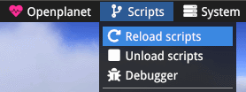

# Requirements
* Windows
* Python ≥ 3.7
* Trackmania 2020 or trackmania Forever

# Installation

1. Clone tmrl repository
```shell
git clone https://github.com/yannbouteiller/tmrl.git
cd tmrl
```
2. Create a conda environement shell 
```shell
conda create --name tmrl
conda activate tmrl
```

2. Install the libraries
```shell
 cd inputs-mod
 python setup.py install
 cd ..
 python setup.py install
 cd agent-rt
```
## Trackmania 2020


If you want to run the self-driving-car on Trackmania 2020, we will need to install 
[Openplanet](https://openplanet.nl/).

After that, copy the files `Plugin_MyFirstScript.as` and `Plugin_MyFirstScript.as.sig` and paste it in `C:\Users\username\OpenplanetNext\Scripts`

Launch Trackmania 2020 game click `f3` to open Openplanet and reload the script 




## game controller

If you want to control the car with a analogic input we will need to install [vjoy](http://vjoystick.sourceforge.net/site/index.php/download-a-install/download)